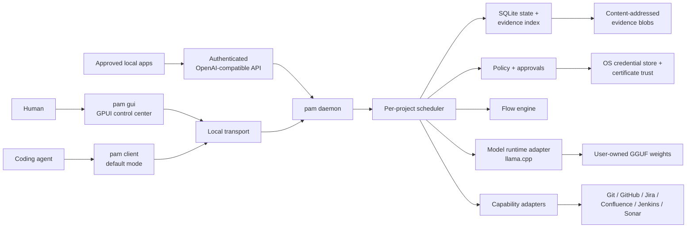
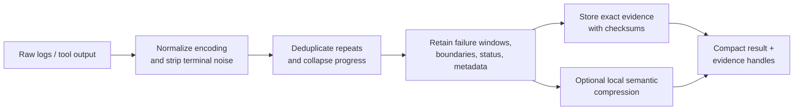

# Architecture

## Shape

PAM is distributed as one application artifact. Subcommands select a mode, but
all modes share the same versioned domain types and policy engine.

The GUI is a client of the same daemon protocol as the CLI. It may start and
stop the daemon, but it does not gain a private path around policy or durable
state.

## Runtime modes

| Invocation | Responsibility |
| --- | --- |
| `pam …` | Fast client; discovers project and caller, submits requests, streams events, and prints compact results. |
| `pam daemon` | Owns queues, durable state, connectors, policy, model runtime, and local APIs. |
| `pam gui` | Native control center for daemon lifecycle, project queues, flows, models, access, certificates, and evidence. |

If the client cannot reach the daemon, it should provide an exact recovery
action. Automatic daemon start may be offered only when policy and installation
mode allow it.

## Identity and queueing

Caller identity and project identity are separate.

- A **caller** is a registered CLI session, coding-agent integration, GUI, or
  approved local application. It receives a revocable credential and declared
  capabilities.
- A **project** is resolved from explicit input, a `.pam/project.toml` marker,
  or a normalized repository root. Its stable ID must not depend only on a path
  that can move.
- A **request** carries protocol version, request ID, caller ID, project ID,
  capability, idempotency key, deadline, and payload.

Caller labels remain non-secret routing identities. A separate high-entropy
credential authenticates every request; PAM stores only its SHA-256 verifier and
uses a constant-time comparison. Registration and revocation are local-user
administrative operations against the protected per-user state database, not
network-reachable protocol capabilities. Revocation is immediate for subsequent
requests, survives daemon restart, and deliberately returns the same external
failure as an unknown caller or invalid credential. Re-registering a revoked
caller issues a new credential and invalidates the old one.

Project policy is default-deny. Grants bind one caller, project, capability, and
either an exact resource or an explicit any-resource scope. Active explicit
denies override allows; expiry and revocation take effect at their recorded
millisecond boundary. Each grant mutation advances a durable project-policy
version.

Approval-required grants create a durable request bound to a collision-safe
SHA-256 fingerprint of the caller, project, capability, and exact resource.
Only a registered active local approver can approve or deny it. Approved
receipts are consumed transactionally at the policy gate, exactly once, before
the effect; mismatched, denied, expired, or previously consumed receipts never
authorize work. Protocol failures carry the approval ID and expiry without
exposing credentials.

Each project has one durable ordered queue. The scheduler serializes stateful or
conflicting operations. A flow can declare read-only collection steps safe for
parallel execution, but their results rejoin the ordered project event stream.
Global resources such as the model runtime have separate capacity controls so a
large inference request cannot starve every project.

## Protocol and transport

The application protocol is transport-neutral and versioned independently from
the binary. The first transport adapter uses ZeroMQ Router/Dealer semantics:

| Platform | First transport | Planned hardening |
| --- | --- | --- |
| macOS | Unix-domain IPC endpoint in the user runtime directory | launchd integration and signed peer registration |
| Linux | Unix-domain IPC endpoint | systemd user service and peer credential checks |
| Windows | authenticated loopback TCP | native named-pipe adapter after protocol stabilization |

ZeroMQ availability is a build/runtime implementation detail, never exposed in
the command contract. Message envelopes use Serde with a compact binary encoding
and an explicit maximum frame size. Large logs and artifacts are stored once and
referenced by content hash instead of traveling through IPC frames.

The daemon publishes a replayable event sequence per request. Reconnect uses a
request ID and last observed sequence number; it does not restart the work.

## Durable state

SQLite in WAL mode stores metadata, queues, leases, flow definitions and runs,
policy decisions, audit events, model registrations, and evidence references.
A dedicated database worker owns the connection behavior rather than allowing
unbounded blocking work on async executors.

Potentially large or sensitive evidence lives in a content-addressed blob
directory with checksums, size/type metadata, project ownership, retention, and
redaction state. A compact result stores references into this evidence graph.
Deletion and retention are explicit operations with audit events.

PAM integrates with `ptrack` through its supported command or future protocol.
It does not read or mutate `ptrack`'s database schema directly.

## Evidence pipeline

Deterministic reduction always runs first. Model compression is optional,
policy-controlled, and never replaces the exact retained source. Every model
claim must cite an evidence handle or be labeled as an inference.

## Flow execution

A flow definition is data, not arbitrary daemon code. Initial step types are:

- run an allowlisted local command in a declared working directory;
- call a registered connector capability;
- transform or compact evidence;
- evaluate a condition over structured output;
- request human approval;
- emit a result or handoff.

The engine records a state transition before and after each externally visible
effect. Idempotency keys protect retries. Destructive, publishing, merging, or
ticket-mutating steps require policy evaluation at the point of effect, even if
the flow itself was previously approved.

## Security boundaries

1. **Caller boundary:** local reachability is not identity. Callers register and
   authenticate; credentials are revocable and never written to flow files.
2. **Project boundary:** evidence and policy are scoped to a stable project ID.
   Cross-project reads require a separate grant.
3. **Capability boundary:** connectors expose typed operations rather than raw
   secrets or a universal shell.
4. **Approval boundary:** PAM displays the exact effect, target, and evidence
   before a sensitive action.
5. **Network boundary:** connectors honor operating-system trust, corporate CAs,
   proxies, explicit destinations, and project egress policy.
6. **Model boundary:** untrusted prompts and tool output cannot authorize
   capabilities. Model output is data until validated by the engine.

Local API listeners bind only to loopback, require authentication, redact
secrets from logs, impose body/concurrency limits, and are disabled until the
user explicitly enables them.

## Portability rules

- Platform paths, IPC, credential stores, service managers, code signing, and
  hardware acceleration live behind interfaces with contract tests.
- Core queue, protocol, flow, policy, compaction, and evidence crates contain no
  platform UI or service-manager code.
- macOS may ship first, but portable tests run on Linux from the start.
- Windows-specific implementation begins only after protocol and path semantics
  are explicit; callers never assemble Unix-only paths.
